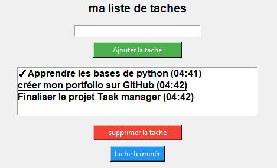

Gestionnaire de Tâches Desktop(Mon premier projet)

Bienvenue sur mon dépot GitHub ! Voici mon application de gestion de taches développée en python,il s'agit d'une application de bureau permettant de gérer efficacement ses tâches quotidiennes avec une sauvegarde automatique.

## ✨ Fonctionnalités :
* *Ajouter* : Créer de nouvelles tâches rapidement.
* *Sauvegarde* : Les tâches sont conservées automatiquement.
* *Interface* : Une fenêtre simple et intuitive.

## 📸 Aperçu du projet :

## 🛠️ Technologies :
* *Python* 
* *Tkinter* (Interface graphique)
